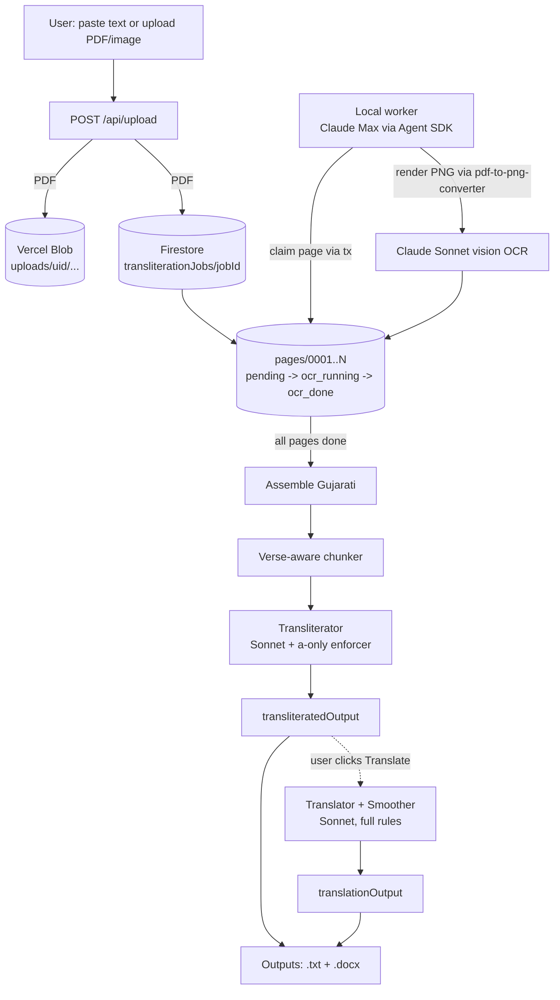

# Aksharpith — System Architecture

```
    A K S H A R P I T H
    ──────────────────────────────────────────────
    Page-by-page Gujarati transliteration pipeline
    with optional English translation
    (Sacred BAPS Swaminarayan corpus)

    Trustee of Tradition. Guardian of Accuracy.
```

> **Mission:** Render the Swaminarayan Sampraday's Gujarati sacred literature into
> publication-quality Roman-script transliteration (with optional English translation)
> at Aksharpith's editorial standards — and do it in minutes, not months.

> **Philosophy:** The pipeline is a *trustee of tradition*, not a creative
> interpreter. Every architectural decision prioritises **fidelity to source**,
> **terminological exactness**, and **deterministic enforcement** of house rules.
> LLMs transliterate, translate, and smooth; deterministic code has the final word.

---

## 0. Transliteration-First Pipeline (May 2026 pivot)

The current primary product is **Roman-script transliteration** of Gujarati input
(with the ā-only diacritic rule from House Rules §2.2). English translation became
an *optional secondary stage* triggered from the transliteration view.

Big PDFs are processed **page-by-page**: each PDF page is its own OCR unit, claimed
by the local worker via Firestore transactions. This eliminates the multi-page-chunk
throttling the OAuth/Max-plan path exhibited under sustained load.

### Flow



### Job lifecycle

```
pending -> ocr_running -> assembling -> transliterating -> done
                                                          (user opt-in)
                                                  translating -> done
```

If any page exhausts its retry cap (3), the parent transitions to `failed` and
no further pages are claimed. The user's UI (`/transliterate/[jobId]`) subscribes
to the parent and pages subcollections in real time, rendering a colour-coded
chip rail (one chip per page) plus the assembled outputs as they land.

### Constraints honoured

- **Free tier only** — Vercel Blob (no Anthropic API spend), Claude Max plan via
  the Agent SDK (OAuth token, not API key), Firebase Spark for auth + Firestore.
- **Single-field Firestore queries** — collection-group queries on the pages
  subcollection require index exemptions Firebase doesn't auto-create, so the
  worker queries active parents first and walks each parent's pages subcollection
  directly (auto-indexed).
- **Atomic page claims** — each claim is a single Firestore transaction (parallel
  reads of page + parent, then writes). Stale claims (>10 min) reaped on next poll.

### Files

| Concern | Path |
|---|---|
| Job + page types | `lib/job-types.ts` (`TransliterationJobDocument`, `PageJob`) |
| Upload / job creation | `app/api/upload/route.ts::enqueueTransliterationJob` |
| Worker pollers | `scripts/local-worker.mjs::pollForPageJobs`, `pollForTransliterationJobs` |
| Transliterator prompt | `lib/rules/transliterator-prompt.ts` |
| Transliterator pipeline | `lib/pipeline.ts::runTransliterationPipeline` |
| UI | `app/transliterate/[jobId]/page.tsx` |
| Admin observability | `app/admin/page.tsx::TransliterationFeed` |
| Firestore rules | `firestore.rules` |

The detailed legacy translation pipeline (paste-text flow) is documented in
sections 1–N below and remains operational. PDFs route exclusively through the
transliteration-first flow above.

---

## 1. Technology Stack

| Layer | Technology | Role |
|---|---|---|
| **Framework** | Next.js 15 (App Router) | Server-side API routes, SSE streaming, React UI |
| **Language** | TypeScript 5 | End-to-end type safety across client and server |
| **Auth** | Firebase Auth | Google OAuth + email/password sign-in |
| **Database** | Firebase Firestore | Translations, review sub-collections, training data |
| **AI Models** | Claude Sonnet (prompt-cached) | Translation, review, smoothing |
| **AI Utilities** | Claude Haiku | PDF vision extraction, image OCR |
| **Doc Export** | `docx` package | Formatted .docx generation with verse styling |
| **File Parsing** | `mammoth` | DOCX/DOC text extraction |
| **Hosting** | Vercel (Pro plan, 300s timeout) | Serverless deployment, automatic CI/CD |
| **Fonts** | Cormorant Garamond + Karla | Serif + sans-serif editorial typography |
| **HTTP** | Node.js native `https` | Bypasses Next.js fetch patching for Claude API |

---

## 2. The Six-Stage Pipeline

The core of Aksharpith is a six-stage translation pipeline that combines three LLM stages
with three deterministic stages. The architecture ensures that no translation reaches the
user without passing through both AI-powered quality review AND rule-based enforcement.

```
 ┌─────────────────────────────────────────────────────────────────────────────────┐
 │                                                                                 │
 │   Browser (page.tsx)                                                            │
 │       │                                                                         │
 │       │  POST /api/translate                                                    │
 │       │  { text, chapterTitle?, bookId?, chapterIndex?, totalChapters? }        │
 │       ▼                                                                         │
 │  ╔══════════════════════════════════════════════════════════════════════════╗    │
 │  ║                    STAGE 1: CHUNKER                                     ║    │
 │  ║                    ────────────────                                      ║    │
 │  ║    Type: DETERMINISTIC (no LLM)                                         ║    │
 │  ║                                                                          ║    │
 │  ║    Verse-aware splitting at paragraph boundaries                         ║    │
 │  ║    300-500 words per chunk; single-newline fallback                      ║    │
 │  ║    ≤500 words → single chunk; trailing <150w merged into previous        ║    │
 │  ╚══════════════════════════╦═══════════════════════════════════════════════╝    │
 │                             │ chunks[]                                           │
 │                             ▼                                                    │
 │  ╔══════════════════════════════════════════════════════════════════════════╗    │
 │  ║                    STAGE 2: TRANSLATOR                                  ║    │
 │  ║                    ──────────────────                                    ║    │
 │  ║    Model: Claude Sonnet (prompt-cached) · Parallel batches of 5         ║    │
 │  ║                                                                          ║    │
 │  ║    buildTranslatorSystem() prompt includes:                              ║    │
 │  ║      • Full glossary (~230 terms, 14 categories)                         ║    │
 │  ║      • 10-section House-Style Guide                                      ║    │
 │  ║      • Forbidden vocabulary (38 terms)                                   ║    │
 │  ║      • Verse handling rules                                              ║    │
 │  ║                                                                          ║    │
 │  ║    ► rulesEnforcerAgent() applied to each chunk output                   ║    │
 │  ╚══════════════════════════╦═══════════════════════════════════════════════╝    │
 │                             │ translations[]                                     │
 │                             ▼                                                    │
 │  ╔══════════════════════════════════════════════════════════════════════════╗    │
 │  ║                    STAGE 3: REVIEWER                                    ║    │
 │  ║                    ────────────────                                      ║    │
 │  ║    Model: Claude Sonnet (prompt-cached) · Parallel batches of 5         ║    │
 │  ║                                                                          ║    │
 │  ║    Weighted 97% Rubric Evaluation:                                       ║    │
 │  ║    ┌──────────────────┬────────┬────────────────────────────────────┐    ║    │
 │  ║    │ Category         │ Weight │ Measures                           │    ║    │
 │  ║    ├──────────────────┼────────┼────────────────────────────────────┤    ║    │
 │  ║    │ Fidelity         │   30   │ Nothing added/omitted; 1:1 source │    ║    │
 │  ║    │ Terminology      │   25   │ All BAPS terms exactly correct    │    ║    │
 │  ║    │ Verse Handling   │   15   │ Transliteration first, then meang │    ║    │
 │  ║    │ Style & Register │   15   │ UK English, curly quotes, tone    │    ║    │
 │  ║    │ Historical Prec. │   10   │ Era-correct names, exact dates    │    ║    │
 │  ║    │ Completeness     │    5   │ No summarisation or truncation    │    ║    │
 │  ║    └──────────────────┴────────┴────────────────────────────────────┘    ║    │
 │  ║                                                                          ║    │
 │  ║    Iterative: if score < 96 → re-review (up to 2 rounds)                ║    │
 │  ║    Output: per-category scores + corrected text + pitfalls               ║    │
 │  ║    ► chunkData stored for training export                                ║    │
 │  ╚══════════════════════════╦═══════════════════════════════════════════════╝    │
 │                             │ reviews[]                                          │
 │                             ▼                                                    │
 │  ╔══════════════════════════════════════════════════════════════════════════╗    │
 │  ║                    STAGE 4: SMOOTHER                                    ║    │
 │  ║                    ────────────────                                      ║    │
 │  ║    Model: Claude Sonnet (prompt-cached) · Parallel batches of 5         ║    │
 │  ║                                                                          ║    │
 │  ║    Readability pass with protected-terms guardrail                        ║    │
 │  ║    Diff guard: if >15% character change → revert to reviewer output      ║    │
 │  ║    ► rulesEnforcerAgent() applied to each chunk output                   ║    │
 │  ╚══════════════════════════╦═══════════════════════════════════════════════╝    │
 │                             │ smoothed[]                                         │
 │                             ▼                                                    │
 │  ╔══════════════════════════════════════════════════════════════════════════╗    │
 │  ║                    STAGE 5: ASSEMBLER                                   ║    │
 │  ║                    ──────────────────                                    ║    │
 │  ║    Type: DETERMINISTIC (no LLM)                                         ║    │
 │  ║                                                                          ║    │
 │  ║    Deduplicates boundary overlaps between chunks                         ║    │
 │  ║    Removes chunk markers and artefacts                                   ║    │
 │  ║    Joins with clean paragraph breaks                                     ║    │
 │  ║    Skipped if input was a single chunk                                   ║    │
 │  ╚══════════════════════════╦═══════════════════════════════════════════════╝    │
 │                             │ assembled text                                     │
 │                             ▼                                                    │
 │  ╔══════════════════════════════════════════════════════════════════════════╗    │
 │  ║                    STAGE 6: RULES ENFORCER                              ║    │
 │  ║                    ──────────────────────                                ║    │
 │  ║    Type: DETERMINISTIC (no LLM)                                         ║    │
 │  ║                                                                          ║    │
 │  ║    47+ regex rules across 5 categories:                                  ║    │
 │  ║      Terminology (25) + Personal Names (3) + Place Names (7)             ║    │
 │  ║      + Punctuation (quotes, dashes) + Diacritics (12 mappings)           ║    │
 │  ║                                                                          ║    │
 │  ║    Also enforces: forbidden vocab (38 terms), hedging removal            ║    │
 │  ║    Logs every correction: { from, to, rule, count }                      ║    │
 │  ╚══════════════════════════════════════════════════════════════════════════╝    │
 │                                                                                 │
 │  ► Save to Firestore (with chunkData for training export)                       │
 │  ► Emit translationId SSE event (enables reviews + export)                      │
 │                                                                                 │
 └─────────────────────────────────────────────────────────────────────────────────┘
```

### 2.1 Pipelined Chunk Processing

Stages 2-4 are **pipelined per-chunk**: as soon as a chunk finishes translating, it
immediately enters review, then smoothing -- without waiting for sibling chunks. This
maximises throughput within the 300-second Vercel timeout:

```
Time ──────────────────────────────────────────────────────────────────────────────►

Chunk 1:  ████ TRANSLATE ████ ──► ██████ REVIEW ██████ ──► ███ SMOOTH ███
Chunk 2:     ████ TRANSLATE ████ ──► ██████ REVIEW ██████ ──► ███ SMOOTH ███
Chunk 3:        ████ TRANSLATE ████ ──► ██████ REVIEW ██████ ──► ███ SMOOTH ███
Chunk 4:           ████ TRANSLATE ████ ──► ██████ REVIEW ██████ ──► ███ SMOOTH ███
Chunk 5:              ████ TRANSLATE ████ ──► ██████ REVIEW ██████ ──► ███ SMOOTH ███
                                                                                    │
                      All chunks smoothed ──────────────────────────────────────────┘
                                                                                    │
                                          ███ ASSEMBLE (deterministic) ███ ──► ███ ENFORCE (deterministic) ███
```

**Concurrency:** 5 chunks process in parallel at each LLM stage. The pipeline begins
the next batch as soon as the current batch completes, creating a wave-front of
overlapping work that keeps API utilisation high.

### 2.2 Stage Allocation Summary

| Stage | Engine | Model | Max Tokens | Parallelism |
|---|---|---|---|---|
| 1. Chunker | Deterministic | -- | -- | Single-pass |
| 2. Translator | Claude Sonnet | claude-sonnet-4-20250514 | 8,192 | Batches of 5 |
| 3. Reviewer | Claude Sonnet | claude-sonnet-4-20250514 | 16,000 | Batches of 5 |
| 4. Smoother | Claude Sonnet | claude-sonnet-4-20250514 | 8,192 | Batches of 5 |
| 5. Assembler | Deterministic | -- | -- | Single-pass |
| 6. Rules Enforcer | Deterministic | -- | -- | Single-pass |
| PDF Extractor | Claude Haiku | claude-haiku-4-5-20251001 | 16,000 | Per-page |
| Image OCR | Claude Haiku | claude-haiku-4-5-20251001 | 16,000 | Per-image |

**Key parameters:**

| Parameter | Value | Rationale |
|---|---|---|
| Batch size | 5 | Maximises throughput without hitting API rate limits |
| Recheck threshold | 96/100 | Chunks below this score are re-reviewed |
| Max review rounds | 2 | Balanced against 300s Vercel timeout |
| API call timeout | 90 seconds | Per Claude call, with 1 retry on failure |
| Prompt caching | Enabled | `anthropic-beta: prompt-caching-2024-07-31` header; system prompts sent as cacheable `ephemeral` content blocks |
| Diff guard | 15% | If smoother changes >15% of characters, revert to reviewer output |

---

## 3. Evaluation: The 97% Rubric and the Deterministic Gap

### 3.1 Weighted Rubric Scoring

The reviewer evaluates every chunk against a **six-category weighted rubric** with a
certification threshold of 97/100:

```
┌──────────────────────────────────────────────────────────────────────────┐
│                     97% ACCURACY RUBRIC                                  │
│                                                                          │
│  Category              Weight    What is Measured                        │
│  ═══════════════════   ══════    ═══════════════════════════════════════  │
│  Fidelity                30      Nothing added or omitted. Every source  │
│                                  sentence maps to an English sentence.   │
│                                  Direct quotes first-person. Exact       │
│                                  numbers, dates, and names.              │
│                                                                          │
│  Terminology             25      All mandatory BAPS terms correct:       │
│                                  mandir, Swami, bawa, austerities,       │
│                                  Shriji Maharaj, Akshardham,             │
│                                  paramhansa, brahmisthiti, etc.          │
│                                                                          │
│  Verse Handling          15      Transliteration FIRST, then meaning.    │
│                                  Only 'a' diacritic in verses. Full      │
│                                  reproduction. Consistent format.        │
│                                                                          │
│  Style & Register        15      UK English Oxford -ize spelling.        │
│                                  Curly quotes. Spaced en dashes.         │
│                                  Dignified, reverent tone. No            │
│                                  forbidden vocabulary.                   │
│                                                                          │
│  Historical Precision    10      Era-correct names (Bombay Province).    │
│                                  Exact dates (3 April 1781). Exact       │
│                                  place spellings per Aksharpith.         │
│                                                                          │
│  Completeness             5      All paragraphs translated. No           │
│                                  summarisation. No truncation.           │
│  ─────────────────────────────────────────────────────────────────────   │
│  TOTAL                  100      Certifiable = total >= 97               │
│                                  AND zero critical violations            │
└──────────────────────────────────────────────────────────────────────────┘

Deduction scale:
  Critical violation  →  -60% of category weight
  Major violation     →  -40% of category weight
  Minor violation     →  -20% of category weight
```

### 3.2 The Cross-Stage Gap: How Deterministic Enforcement Closes 7 Points

Independent evaluation revealed a persistent gap between what the LLM stages produce
and what publication standards require. The Rules Enforcer (Stage 6) exists specifically
to close this gap deterministically:

```
                PIPELINE QUALITY PROGRESSION

  Stage Output          Estimated Score     Delta
  ═══════════════════   ═══════════════     ═════
  After Translation     ~85/100             --
  After Review          ~90-91/100          +5-6
  After Smoothing       ~91/100             +0-1
  After Enforcement     ~97-98/100          +6-7    ◄── deterministic rules
                                                         close the gap

  ┌─────────────────────────────────────────────────────────────────┐
  │                                                                 │
  │  100 ┤                                                ┌───┐    │
  │   98 ┤                                         ┌───┐  │///│    │
  │   96 ┤  - - - - - - - - - - THRESHOLD - - - -  │   │  │///│    │
  │   94 ┤                                    │   │  │   │  │///│    │
  │   92 ┤                            ┌───┐  │   │  │   │  │///│    │
  │   90 ┤                     ┌───┐  │   │  │   │  │   │  │///│    │
  │   88 ┤              ┌───┐  │   │  │   │  │   │  │   │  │///│    │
  │   86 ┤       ┌───┐  │   │  │   │  │   │  │   │  │   │  │///│    │
  │   84 ┤       │   │  │   │  │   │  │   │  │   │  │   │  │///│    │
  │   82 ┤       │   │  │   │  │   │  │   │  │   │  │   │  │///│    │
  │      └───────┴───┴──┴───┴──┴───┴──┴───┴──┴───┴──┴───┴──┴───┴── │
  │         Trans.  Review  Smooth  Review  Smooth  ENFORCE         │
  │          (S2)    (S3)    (S4)   +recheck        (S6)            │
  │                                                                 │
  │  ///  = Deterministic enforcement gain (~7 points)              │
  └─────────────────────────────────────────────────────────────────┘
```

**Key insight:** The LLM stages (Translator, Reviewer, Smoother) achieve ~90-91/100 --
strong but inconsistent. They occasionally miss terminology substitutions, allow
forbidden diacritics, or use straight quotes. The Rules Enforcer's 47+ regex rules
provide a **deterministic safety net** that reliably pushes output above the 97%
certification threshold. Sprint 1 regex additions alone recover approximately 7 points.

---

## 4. Modular Rules System (`lib/rules/`)

All translation rules, glossary, prompts, and forbidden vocabulary are extracted into a
modular system for maintainability. **No pipeline code needs to change when updating
rules** -- edit the relevant module:

```
lib/rules/
├── types.ts              6 interfaces   Shared types: GlossaryEntry, TerminologyRule,
│                                        ReviewComment, OutputSection, TrainingDataEntry,
│                                        RulesCorrection
│
├── glossary.ts         ~230 entries     Master Theological Glossary across 14 categories:
│                                        Core Doctrinal, Inner Faculties, Spiritual Practice,
│                                        Cosmic Structure, Realms, Ages, Titles, Scriptures,
│                                        Philosophy, Dissolution, Cultural, Ritual,
│                                        Doctrinal Distinctions, and more
│
├── house-rules.ts       10 sections     Aksharpith House-Style Guide as structured data
│                                        with formatHouseRulesForPrompt() builder
│
├── terminology.ts       47 rules        25 terminology + 3 personal names + 7 place names
│                                        + 12 diacritics mappings
│                                        + 8 sadhus/sannyasis/avatari name rules
│                                        + forbidden vocab & hedging enforcement
│
├── forbidden-vocab.ts   38 terms        Words/phrases banned from output:
│                                        mythology, charismatic, stakeholder, trauma,
│                                        narrative, paradigm, etc.
│
├── protected-terms.ts   20 terms        BAPS terms the smoother/assembler must NEVER
│                                        modify: Akshardham, paramhansa, brahmisthiti,
│                                        Shriji Maharaj, satsang, etc.
│
├── prompts.ts            4 builders     buildTranslatorSystem(), buildReviewerSystem(),
│                                        buildSmootherSystem(), buildAssemblerSystem()
│                                        Each composes from glossary + house rules +
│                                        forbidden vocab + protected terms
│
└── index.ts                             Barrel re-exports for clean imports
```

### 4.1 Rules Enforcer: 47+ Rules Across 5 Categories

#### Terminology Rules (25)

| Incorrect | Corrected |
|---|---|
| temple(s) | mandir(s) |
| saint(s) | Swami(s) |
| monk(s) | Swami(s) |
| haribhakta(s) | devotee(s) |
| follower(s) | devotee(s) |
| penance | austerities |
| torchbearer | successor |
| aarti | arti |
| vicharan | vichran |
| dhotiyos | dhotiyas |
| Brahmic state | brahmisthiti |
| scripture(s) | shastra(s) |
| congregation | satsang |
| Hindu mythology | Hindu sacred history |
| mythology | sacred history |
| Lord Swaminarayan | Bhagwan Swaminarayan |
| divine abode | Akshardham |
| Shrijimaharaj | Shriji Maharaj |
| Shri Ji Maharaj | Shriji Maharaj |
| *+ 6 more* | *terminology rules* |

#### Personal Name Rules (3)

| Incorrect | Corrected |
|---|---|
| Bhilalbhai | Bhailalbhai |
| Narayanda | Naran'da |
| Naranda | Naran'da |

#### Place Name Rules (7)

| Incorrect | Corrected |
|---|---|
| Pipalana | Piplana |
| Chanasad | Chansad |
| Bamangaon | Bamangam |
| Dholiya | Dhuliya |
| Dungara | Dangara |
| Bhadarod | Bhadrod |
| Chokshi | Choksi |

#### Punctuation Rules

| Pattern | Replacement | Purpose |
|---|---|---|
| Straight double quotes `"..."` | Curly paired quotes `"..."` | Aksharpith house style |
| Straight single quotes `'...'` | Curly paired quotes `'...'` | Aksharpith house style |
| Em dashes `--` | Spaced en dashes ` -- ` | UK English convention |

#### Diacritics Rules (12 mappings)

Strips all forbidden diacritics, preserving **only** the macron-a (`a`):

| Forbidden | Replaced With |
|---|---|
| `m with dot` | m |
| `t with dot` | t |
| `s with dot` | sh |
| `s with accent` | sh |
| `n with dot` | n |
| `i macron` | i |
| `u macron` | u |
| `r with dot` | r |
| `n with overdot` | n |
| `d with dot` | d |
| `h with stroke` | h |
| `n with tilde` | n |

Every correction is logged with `{ from, to, rule, count }` and surfaced in the QA
Summary UI, providing full transparency into what the enforcer changed and why.

---

## 5. Review and Comment System

Per-section commenting with Firestore persistence enables collaborative human review
of translations by editors, scholars, and Aksharpith leadership.

### 5.1 Data Model

```
Firestore
│
└── translations/{translationId}
        │
        ├── uid: string                    # Translator's user ID
        ├── email: string                  # Translator's email
        ├── output: string                 # Final translated text
        ├── avgScore: number               # Average reviewer rubric score
        ├── chunkData: ChunkData[]         # Per-chunk scores, categories, pitfalls
        ├── corrections: RulesCorrection[] # Enforcer corrections log
        ├── createdAt: string              # ISO 8601 timestamp
        ├── ...
        │
        └── reviews/ (sub-collection)
                │
                └── {reviewId}
                        ├── uid: string            # Commenter's user ID
                        ├── email: string          # Commenter's email
                        ├── displayName: string    # Shown in UI
                        ├── comment: string        # The review comment
                        ├── sectionIndex: number   # Which output section
                        └── createdAt: string      # ISO 8601 timestamp
```

### 5.2 API Endpoints

| Method | Endpoint | Description |
|---|---|---|
| `POST` | `/api/reviews` | Add a comment (`translationId`, `sectionIndex`, `comment`) |
| `GET` | `/api/reviews?translationId=X` | List all comments for a translation |
| `GET` | `/api/reviews/{translationId}?sectionIndex=N` | Get comments grouped by section |

### 5.3 UI Flow

```
 ┌─────────────────────────────────────────────────────┐
 │  Output View                                         │
 │                                                      │
 │  ┌──────────────────────────────────────────┐        │
 │  │  Prose section 1                 [+ Comment]│◄──── Hover reveals button
 │  │  The sacred assembly gathered...          │        │
 │  └──────────────────────────────────────────┘        │
 │                                                      │
 │  ┌──────────────────────────────────────────┐        │    ┌──────────────┐
 │  │  Verse section 2           [2] [+ Comment]│───────│───►│ ReviewPanel  │
 │  │  "Preme pragatya re..."                   │        │    │ (slide-in)   │
 │  │  (With love arose...)                     │        │    │              │
 │  └──────────────────────────────────────────┘        │    │ Jay (3m ago) │
 │                                                      │    │ "Check verse │
 │  ┌──────────────────────────────────────────┐        │    │  format"     │
 │  │  Prose section 3                 [+ Comment]│      │    │              │
 │  │  Shriji Maharaj then spoke...             │        │    │ [Add comment]│
 │  └──────────────────────────────────────────┘        │    └──────────────┘
 └─────────────────────────────────────────────────────┘
```

1. Output is parsed into prose/verse sections by `parseOutputSections()`
2. Hovering over any section reveals a **+ Comment** button
3. Clicking opens the **ReviewPanel** -- a slide-in sidebar with existing comments and a form
4. Comment counts `[2]` are shown per-section and refresh when the panel closes
5. Comments are persisted in Firestore and available to all authorised users

---

## 6. Document Export System

Multi-format export serves different audiences -- from quick review to editorial
production to model fine-tuning:

### 6.1 Export Formats

| Format | Generation | Audience | Description |
|---|---|---|---|
| `.txt` | Client-side | Quick review | Plain text download, no API call needed |
| `.docx` | Server-side (`/api/export`) | Aksharpith editors | Formatted Word document with verse styling: left-border, italic transliteration, indented meaning lines |
| `.docx` + reviews | Server-side (`/api/export`) | Editorial review | Word document with appended review comments section |
| Training `.json` | Server-side (`/api/export`) | ML engineering | Full training data with source, translations, scores, reviewer categories, comments, and metadata |

### 6.2 Training Data Export Schema

```json
{
  "translationId": "abc123",
  "inputPreview": "...",
  "inputWordCount": 1200,
  "outputWordCount": 1350,
  "avgScore": 94,
  "chapterTitle": "Chapter 1",
  "output": "With love arose the sun...",
  "chunkData": [
    {
      "source": "<original Gujarati chunk>",
      "translation": "<translator output>",
      "reviewerOutput": "<reviewer corrected text>",
      "smoothedOutput": "<smoother output>",
      "score": 96,
      "categories": {
        "Fidelity": 29, "Terminology": 24, "Verse": 14,
        "Style": 15, "Historical": 10, "Completeness": 5
      },
      "pitfalls": ["Minor: verse format inconsistency"],
      "issues": []
    }
  ],
  "corrections": [
    { "from": "temple", "to": "mandir", "rule": "terminology", "count": 3 }
  ],
  "reviews": [
    {
      "id": "r1",
      "uid": "u1",
      "email": "user@example.com",
      "displayName": "Jay",
      "comment": "Check terminology in para 3",
      "sectionIndex": 2,
      "createdAt": "2026-03-16T10:00:00Z"
    }
  ],
  "exportedAt": "2026-03-16T12:00:00Z",
  "exportedBy": "user@example.com"
}
```

This schema captures the full provenance chain: source text, each stage's output,
rubric scores per category, enforcer corrections, and human review comments --
everything needed to fine-tune future models or audit translation quality.

---

## 7. Output View and Verse Formatting

The output tab renders a rich document view rather than plain pre-wrapped text, with
intelligent detection of prose vs. verse sections.

### 7.1 Section Detection (`lib/parse-output.ts`)

`parseOutputSections(text)` splits the translation into typed sections:

| Type | Detection Criteria |
|---|---|
| **Verse** | Contains diacritical marks (a, i, u, etc.), curly-quoted lines, italic markers, or multiple short lines of similar length |
| **Prose** | Everything else |

### 7.2 Verse Rendering (`VerseBlock.tsx`)

```
 ┌─────────────────────────────────────────────────────────────────┐
 │                                                                 │
 │  ▎  "Preme pragatya re suraj Sahajanand"                       │
 │  ▎  (With love arose the sun Sahajanand)                       │
 │  ▎                                                              │
 │  ▎  "Adharma andharu taliyum re jag mahi"                      │
 │  ▎  (The darkness of unrighteousness was dispelled              │
 │  ▎   from the world)                                            │
 │  ▎                                                              │
 │  ▎  "Sundariyu paheryu re Akshar Purushottam nu"               │
 │  ▎  (The beautiful attire of Akshar-Purushottam)                │
 │                                                                 │
 └─────────────────────────────────────────────────────────────────┘
   amber left-border  ·  warm ivory background  ·  Cormorant Garamond serif
   italic transliteration lines  ·  parenthesised English meaning
```

### 7.3 QA Summary (`QualitySummary.tsx`)

After every translation, a QA Summary panel displays pipeline quality data:

```
 ┌─────────────────────────────────────────────────────────────────┐
 │  QA SUMMARY                                                     │
 │                                                                 │
 │  Reviewer Scores (avg: 96.2/100)                                │
 │  ┌──────────────┬────────┬───────┐                              │
 │  │ Category     │ Weight │ Score │                              │
 │  ├──────────────┼────────┼───────┤                              │
 │  │ Fidelity     │   30   │  29   │                              │
 │  │ Terminology  │   25   │  24   │                              │
 │  │ Verse        │   15   │  14.5 │                              │
 │  │ Style        │   15   │  14   │                              │
 │  │ Historical   │   10   │  10   │                              │
 │  │ Completeness │    5   │   5   │                              │
 │  └──────────────┴────────┴───────┘                              │
 │                                                                 │
 │  Rules Enforcer Corrections (12 total)                          │
 │  ┌──────────────────────────────────────────────────────┐       │
 │  │  Terminology (5)                                     │       │
 │  │    temple → mandir (3x)                              │       │
 │  │    saint → Swami (2x)                                │       │
 │  │  Diacritics (4)                                      │       │
 │  │    removed forbidden diacritics                      │       │
 │  │  Punctuation (3)                                     │       │
 │  │    straight quotes → curly quotes                    │       │
 │  └──────────────────────────────────────────────────────┘       │
 └─────────────────────────────────────────────────────────────────┘
```

Categories displayed: **Terminology**, **Historical Names**, **Place Names**,
**Punctuation**, **Diacritics**, **Forbidden Vocab**, **Hedging**.

---

## 8. SSE Event Schema

The pipeline streams real-time progress to the browser via Server-Sent Events. Each
stage emits structured JSON events:

```typescript
// ── Stage 1: Chunker ──────────────────────────────────────────────
{ stage: 'chunker', status: 'running' }
{ stage: 'chunker', status: 'done', count: number, chunks: string[] }

// ── Stage 2: Translator ───────────────────────────────────────────
{ stage: 'translator', status: 'running' }
{ stage: 'translator', status: 'progress',
  current: number, total: number,
  index: number, translation: string }
{ stage: 'translator', status: 'done', memorySize: number }

// ── Stage 3: Reviewer (weighted rubric certification) ─────────────
{ stage: 'reviewer', status: 'running' }
{ stage: 'reviewer', status: 'progress',
  completed: number, total: number,
  index: number,
  categories: Category[],        // per-category scores
  pitfalls: string[],            // identified issues
  issues: string[],
  score: number,                 // weighted total
  certifiable: boolean,          // score >= 97 && no criticals
  recheck?: boolean,             // true if re-reviewing
  round?: number }               // review round (1 or 2)
{ stage: 'reviewer', status: 'done',
  certCount: number, total: number,
  avgScore: number, rechecked: number }

// ── Stage 4: Smoother ─────────────────────────────────────────────
{ stage: 'smoother', status: 'running' }
{ stage: 'smoother', status: 'progress',
  completed: number, total: number,
  index: number, flagged: boolean }  // true if diff guard triggered
{ stage: 'smoother', status: 'done', flaggedChunks: number }

// ── Stage 5: Assembler ────────────────────────────────────────────
{ stage: 'assembler', status: 'running' }
{ stage: 'assembler', status: 'done' }

// ── Stage 6: Rules Enforcer ───────────────────────────────────────
{ stage: 'enforcer', status: 'running' }
{ stage: 'enforcer', status: 'done',
  output: string,               // final enforced text
  wordCount: number,
  avgScore: number,
  totalFixes: number,
  corrections: { from: string, to: string, rule: string, count: number }[] }

// ── Post-pipeline ─────────────────────────────────────────────────
{ translationId: string }       // Firestore doc ID (enables reviews + export)

// ── Error / Warning ───────────────────────────────────────────────
{ error: string }
{ warning: string }
```

**Keepalive:** A ping is sent every 10 seconds to prevent Vercel idle timeout.

---

## 9. Book Mode: Full-Volume Translation

For book-length inputs (PDFs, DOCX files with chapters), the system automatically
detects chapter boundaries and processes each chapter as a separate pipeline run:

```
 Upload PDF / DOCX / Image
       │
       ▼
 POST /api/upload
   ├── .pdf   → Claude PDF vision (base64, max 32MB)
   ├── .png/.jpg/.webp/.gif → Claude image OCR (max 20MB)
   ├── .docx  → mammoth.convertToHtml() → text with breaks
   ├── .doc   → mammoth attempt, graceful fallback
   └── .txt   → Buffer.toString('utf-8')
       │
       ▼
 Chapter Detection
   ├── Heading-based detection (H1/H2 patterns)
   ├── TOC rejection (tables of contents filtered out)
   └── Word-count fallback (splits long undifferentiated text)
       │
       ▼
 Returns { text, filename, wordCount, chapters[], isBookMode }
       │
       ▼
 For each chapter (sequential):
   ├── POST /api/translate { text, chapterTitle, bookId, chapterIndex }
   ├── Full 6-stage pipeline
   ├── Chapter progress bar updates in real-time
   └── Results accumulated
       │
       ▼
 All chapter outputs joined → displayed as rich document
```

**Capacity:**
- ~3,000-5,000 words per chapter comfortably within 300s timeout
- ~50,000 words maximum per chapter (hard cap)
- Full books: unlimited chapters via sequential book-mode processing

---

## 10. File Structure

```
web/
├── app/
│   ├── layout.tsx                           # Root layout: fonts, metadata, AuthProvider
│   ├── page.tsx                             # Main UI: 6 pipeline stages, QA Summary,
│   │                                        #   rich output view, review panel
│   ├── globals.css                          # CSS variables (light theme), keyframes
│   ├── login/
│   │   └── page.tsx                         # Login: Google OAuth + email/password
│   ├── history/
│   │   └── page.tsx                         # Translation history viewer
│   ├── components/
│   │   ├── OutputView.tsx                   # Rich document view with verse detection
│   │   ├── OutputSection.tsx                # Prose/verse section renderer
│   │   ├── VerseBlock.tsx                   # Verse formatting (italic + meaning)
│   │   ├── ReviewPanel.tsx                  # Slide-in comment panel per section
│   │   ├── DownloadMenu.tsx                 # Multi-format export dropdown
│   │   └── QualitySummary.tsx               # QA showcase (enforcer + reviewer)
│   └── api/
│       ├── translate/
│       │   └── route.ts                     # POST: 6-stage pipeline, SSE stream
│       ├── upload/
│       │   └── route.ts                     # POST: file extraction + chapter detect
│       ├── history/
│       │   └── route.ts                     # GET: user translation history
│       ├── reviews/
│       │   ├── route.ts                     # POST (add) + GET (list) comments
│       │   └── [translationId]/
│       │       └── route.ts                 # GET: reviews grouped by sectionIndex
│       └── export/
│           └── route.ts                     # POST: .docx / .docx+reviews / JSON
├── lib/
│   ├── auth-context.tsx                     # Firebase Auth React context
│   ├── firebase.ts                          # Firebase client config
│   ├── firebase-admin.ts                    # Firebase Admin SDK (server-side)
│   ├── verify-auth.ts                       # JWT token verification for API routes
│   ├── parse-output.ts                      # parseOutputSections(): verse detection
│   └── rules/                               # ◄── Modular rules system
│       ├── types.ts                         # GlossaryEntry, TerminologyRule,
│       │                                    #   ReviewComment, OutputSection,
│       │                                    #   TrainingDataEntry, RulesCorrection
│       ├── glossary.ts                      # ~230 terms across 14 categories
│       ├── house-rules.ts                   # 10 House-Style Guide sections
│       ├── prompts.ts                       # 4 system prompt builders
│       ├── terminology.ts                   # 47 regex rules (terminology, names,
│       │                                    #   places, diacritics, sadhus/avatari)
│       ├── forbidden-vocab.ts               # 38 forbidden words/phrases
│       ├── protected-terms.ts               # 20 BAPS terms (never modify)
│       └── index.ts                         # Barrel re-exports
├── next.config.mjs                          # serverExternalPackages config
├── vercel.json                              # Function timeouts (300s)
├── .env.local                               # API keys + Firebase config (gitignored)
├── package.json                             # Dependencies
└── ARCHITECTURE.md                          # This document
```

---

## 11. Environment Variables

| Variable | Required | Description |
|---|---|---|
| `ANTHROPIC_API_KEY` | Yes | Anthropic Claude API key |
| `FIREBASE_PROJECT_ID` | Yes | Firebase project ID |
| `FIREBASE_CLIENT_EMAIL` | Yes | Firebase Admin SDK service account email |
| `FIREBASE_PRIVATE_KEY` | Yes | Firebase Admin SDK private key |
| `NEXT_PUBLIC_FIREBASE_API_KEY` | Yes | Firebase client API key |
| `NEXT_PUBLIC_FIREBASE_AUTH_DOMAIN` | Yes | Firebase auth domain |
| `NEXT_PUBLIC_FIREBASE_PROJECT_ID` | Yes | Firebase project ID (client) |
| `NEXT_PUBLIC_FIREBASE_STORAGE_BUCKET` | Yes | Firebase storage bucket |
| `NEXT_PUBLIC_FIREBASE_MESSAGING_SENDER_ID` | Yes | Firebase messaging sender ID |
| `NEXT_PUBLIC_FIREBASE_APP_ID` | Yes | Firebase app ID |

---

## 12. Deployment

```
Platform:    Vercel (serverless, Pro plan)
Build:       next build
Region:      Auto
CI/CD:       Automatic on git push to main
Repository:  https://github.com/jp-sapio-health/aksharpith-translator
Production:  https://aksharpith-translate.vercel.app

Function timeouts (vercel.json):
  /api/translate  → maxDuration: 300s  (Pro plan required)
  /api/upload     → maxDuration: 300s
```

---

## 13. Key Dependencies

| Package | Version | Purpose |
|---|---|---|
| `next` | ^15.1.0 | Framework: App Router, API routes, SSE streaming |
| `react` / `react-dom` | ^18.3.1 | UI rendering |
| `firebase` | ^12.10.0 | Client-side auth + Firestore |
| `firebase-admin` | ^13.7.0 | Server-side Firestore + auth verification |
| `mammoth` | ^1.12.0 | DOCX/DOC text extraction |
| `docx` | latest | Word document generation with verse formatting |
| `typescript` | ^5 | End-to-end type safety |

---

## Appendix A: Design Principles

1. **Determinism as final authority.** LLMs are powerful but probabilistic. Every
   translation passes through deterministic enforcement before reaching the user.
   Rules do not hallucinate.

2. **Fidelity over fluency.** The pipeline is calibrated to preserve every sentence,
   date, name, and verse from the source text. Smoothing is constrained by a diff
   guard to prevent over-editing.

3. **Modularity for maintainability.** Rules, glossary, and prompts are isolated in
   `lib/rules/`. Adding a new terminology rule is a one-line change. No pipeline
   code needs modification.

4. **Transparency through logging.** Every enforcer correction, every reviewer score,
   every smoother diff-guard flag is logged and surfaced in the UI. Nothing is hidden.

5. **Training data as a first-class output.** The full provenance chain -- source,
   each stage's output, rubric scores, corrections, human comments -- is exportable
   as structured JSON for future model improvement.

6. **Respect for tradition.** Terminology choices reflect BAPS Swaminarayan Sanstha's
   conventions. "Bhagwan" not "Lord." "Mandir" not "temple." "Sacred history" not
   "mythology." The system is a trustee, not an interpreter.

---

*Last updated: 2026-03-16*
